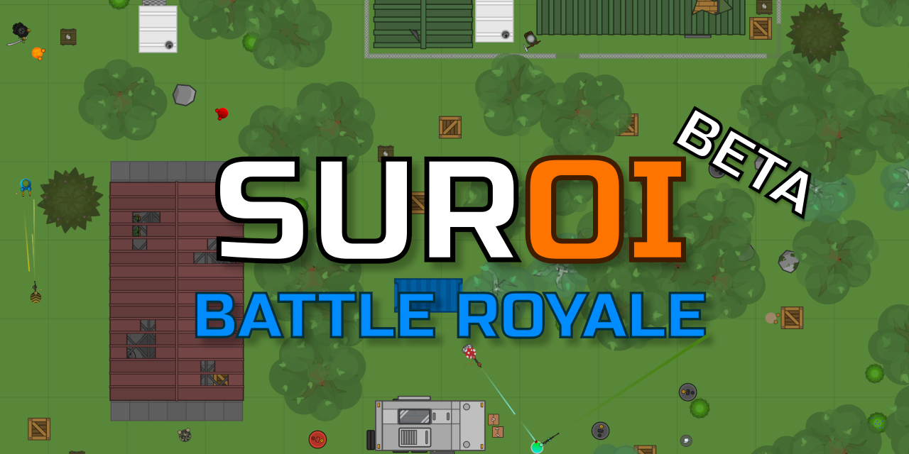

<div align="center">
  
  <hr>
</div>

<div align="center">
  
  
  
  
  
  
  <br>
  
  
  
</div>

## About
Suroi is an open-source 2D battle royale game inspired by [surviv.io](https://survivio.fandom.com/wiki/Surviv.io_Wiki). It is currently a work in progress.

## Play the game!
[suroi.io](https://suroi.io)

## Donate!
Any amount helps! All donation money goes towards the game directly.

[ko-fi.com/suroi](https://ko-fi.com/suroi)

## Join the Discord!
[discord.suroi.io](https://discord.suroi.io)

## Installation and setup
Start by installing [Git](https://git-scm.com/) and [Bun](https://bun.sh).

Use the following command to clone the repo:
```sh
git clone https://github.com/HasangerGames/suroi.git
```

Enter the newly created `suroi` directory with this command:
```sh
cd suroi
```

Finally, run this command in the `suroi` directory to install dependencies:
```sh
bun install
```

## Development
To start the game locally, run the following command in the project root:

```sh
bun dev
```
Or, to see output from the server and client separately, you can use the `bun dev:server` and `bun dev:client` commands. (Both must be running simultaneously for the game to work.)

To open the game, go to http://127.0.0.1:3000 in your browser.

## Production
To build the client for production, run this command in the project root:
```sh
bun build:client
```

To start the game server, run this command:
```sh
bun start
```

Production builds are served using [NGINX](https://nginx.org). Visit [the wiki](https://github.com/HasangerGames/suroi/wiki/Self%E2%80%90hosting) for details on how to self-host.


---

---

## 联机增强服务器版（laihainb666/suroi）

> **多人联机**服务器分支 —— 数十名玩家同场竞技。
> 完整改动说明与部署指南见 **[DEPLOY.md](DEPLOY.md)**。

### 一句话
修好了 fork 里因上游 API 迁移而失效的代码，把两个调试系统对所有玩家开放，
新增 5 个玩法/体验插件，并把配置调成能直接对外开服。

### 修掉的失效代码
上游在小版本间做了不兼容的 API 迁移，本分支的插件停留在旧 API 上 ——
**编译不过，且部分功能从未真正生效**：

| 问题 | 修正 |
|---|---|
| `addPerk("...")` 裸字符串 → 改为 `PerkIds.X` 枚举 | 7 处 |
| `GameConstants.player.health` → `defaultHealth` | 已改 |
| Badge ID 加了 `bdg_` 前缀，`"fire"` → `"bdg_fire"` | 11 处重映射 |
| 相对 import `../../../common/src/utils/math` | 改用 `@common/` 别名 |
| `switch` 的 `Throwable` 分支缺 `break` | 已补 |
| 缺 `default` 分支导致变量可能未赋值 | 已补 |
| **上游自身 bug**：`hasPerk("extended_mags")` 裸字符串 | 改为 `PerkIds.ExtendedMags` |

> 原 fork 的 GM 工具依赖 `troll_face` / `heart` / `pog` / `wave` / `skull`
> 这几个 emote id，它们在 v0.30.5 中**根本不存在** —— 对应功能从未触发过。

### 两个调试系统全部开放

上游的调试功能有两道锁（编译期 `DEBUG_CLIENT` + 运行时 `isDev`），
只有 `isDev: true` 的角色能用。本分支改为配置驱动，**默认对所有玩家开放**：

```jsonc
{
  "allowPublicDebugMenu": true,   // 调试菜单 + 控制台
  "gmToolsPublic": true            // GM 工具（无敌/刷枪/空投/传送）
}
```

改成 `false` 即恢复为「仅 GM 可用」，无需改代码。

### 怎么开启（键位）

| 系统 | 按键 | 说明 |
|---|---|---|
| **控制台** | `` ` ``（反引号） | 上游默认未绑键，本分支补上 |
| **调试菜单** | `F9` | 上游只注册了命令没绑键，本分支补上 |

> 这两个键位在上游是**空的**（`toggle_console` 和 `toggle_debug_menu`
> 都是 `[]`），所以虽然系统初始化了却打不开。本分支已绑定。
> 可在控制台里用 `bind toggle_debug_menu F9` 改成任意按键，
> 或在设置 → 按键绑定里改。

**控制台常用命令**：

```
db_invulnerable true      # 无敌
db_no_clip true           # 穿墙
db_speed_override 0.05    # 移速覆盖
map normal                # 切地图
spawn mg5                 # 刷枪（调试菜单里更方便）
cv_renderer_ resolution   # 渲染设置
```

调试菜单（F9）里是图形化控件：速度滑块、缩放覆盖、无敌开关、层切换、
刷枪下拉、刷假人（含护甲选择），比敲命令直观。

### 插件清单

| 插件 | 功能 |
|---|---|
| `juggernautPlugin` | **巨人模式**：首人成为巨人，2 倍血 + 满配 MG5/Negev，免疫他人伤害，死后由击杀者继任 |
| `killRewardPlugin` | 击杀后立即补满当前武器弹匣 |
| `weaponSwapPlugin` | 击杀后随机换枪并补弹 |
| `gmToolsPlugin` | GM 工具集，11 项功能，公开可用 |
| `multiplayerEnhancementsPlugin` | 首杀奖励、压制播报、输入活跃度统计 |
| `placeObjectPlugin` | （开发用）放置柱子障碍物并输出坐标 |
| `speedTogglePlugin` | （开发用）切换 12 倍速 |
| `teleportPlugin` | （开发用）传送到地图标记处 |

**GM 工具触发**（普通表情即可，无需 GM 身份）：

| badge | 功能 | badge | 功能 |
|---|---|---|---|
| `bdg_fire` 🔥 | 满血 + 满肾上腺素 | `bdg_suroi_logo` 🏆 | 空投到脚下 |
| `bdg_developr` 🛠 | 随机枪械 | `bdg_colon_three` 3️⃣ | 切换无敌 |
| `bdg_donatr` 💛 | 随机近战 | `bdg_duel` ⚔ | 清空武器 |
| `bdg_moderatr` 🛡 | 随机投掷物 ×3 | `bdg_suroi_general_chat` 💬 | 传送到地图中心 |
| `bdg_bleh` 🩹 | 随机治疗品 ×2 | `bdg_aegis_logo` 🛡 | 切换 8 倍速 |
| `bdg_ownr` 👑 | 一键满配 | 地图标记 | 传送到标记处 |

### 面向公开部署的配置

`server/config.example.json` 已按公网调好：

- `hostname: "0.0.0.0"` —— 监听所有网卡（原来只绑 127.0.0.1）
- **动态地图缩放**：<20 人 ×0.75，20–49 人 ×1.0，50+ 人 ×1.25
- `minTeamsToStart: 1` —— 1 人即可开局，不空等
- **反滥用**：单 IP 16 连接、10 秒内 12 次加入尝试、最多 4 个自建房
- 用户名脏词过滤（用 JS 正则语法，不是 PCRE）

### 安全提醒

调试菜单全开意味着**任何人都能开无敌和 8 倍速**。这是按需求开放的，
适合内测 / 社区服。要开公网运营，建议：

1. `allowPublicDebugMenu: false`，只保留 `gmToolsPublic`
   （刷枪 / 空投 / 传送反而是社区乐趣来源，而作弊向量都在前者那侧）
2. 或全开，但在 NGINX 层加连接频率限制
3. 反代时务必设 `ipHeader: "X-Real-IP"`，否则所有玩家会被判为同一 IP

### 快速开始

```sh
bun install

# 开发
bun dev:server    # 终端 1
bun dev:client    # 终端 2 → http://127.0.0.1:3000

# 生产
bun run build:client
bun start
```

**Windows 注意**：`bun x --bun vite build` 在部分版本上会 segfault，
改用 `cd client && node ../node_modules/vite/bin/vite.js build`。

**环境要求**：Bun ≥ 1.2（必须，项目用了 bun workspace）。端口 8000 + 8001+。

---

## License

GPL-3.0 —— 沿用上游 [HasangerGames/suroi](https://github.com/HasangerGames/suroi) 的许可。

官方在线版：https://suroi.io ｜ Discord：https://discord.suroi.io
